# Diagramas Mermaid — Lab 01 Hadoop/MapReduce (Qali Warma)

---

## 1. Arquitectura general (nodo único pseudo-distribuido)

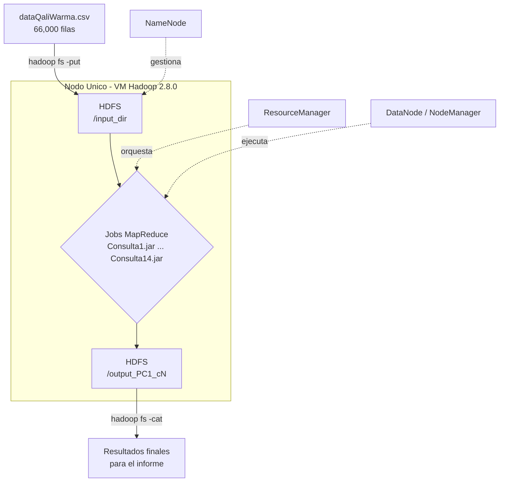

---

## 2. Flujo genérico de un job MapReduce simple (Grupos 1 a 4)

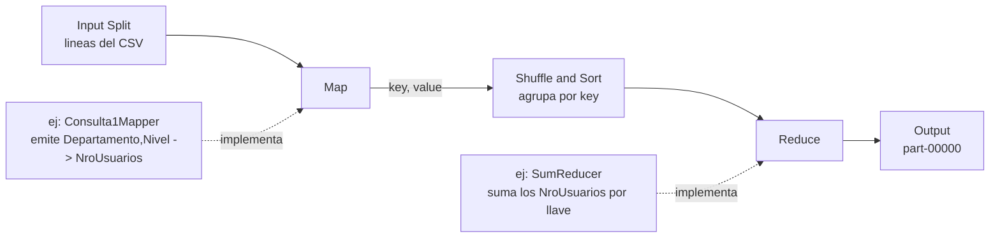

---

## 3. Grupo 5 — MapReduce encadenado con join (Consultas 9 y 10)

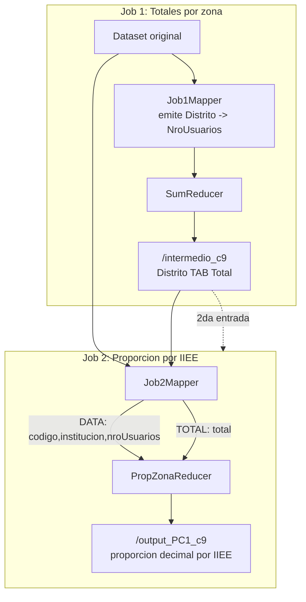

---

## 4. Grupos 6 y 7 — Descenso de gradiente iterativo (Consultas 11-14)

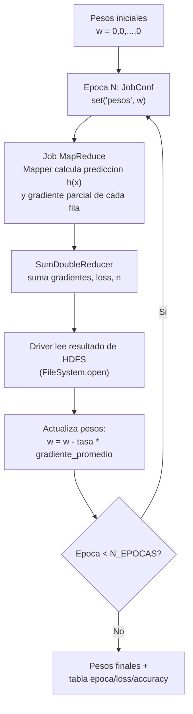

---

---

## 5. Diagramas individuales por consulta

Uno por consulta, pensados para ir junto a su subsección en el informe
(uno chico, no el flujo genérico completo — para eso están los diagramas 2-4).

### Consulta 1 — Total NroUsuarios por Departamento+Nivel
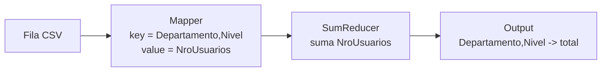

### Consulta 2 — Conteo IIEE por Provincia+Modalidad
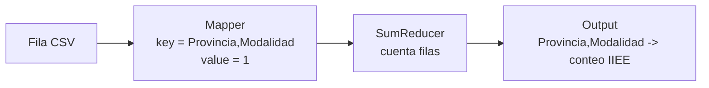

### Consulta 3 — Total NroUsuarios por UnidadTerritorial+Item
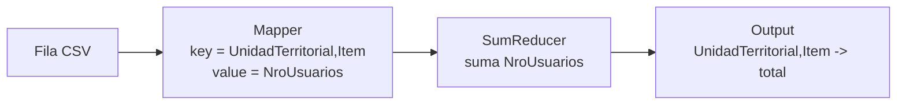

### Consulta 4 — Conteo IIEE por Distrito+Nivel
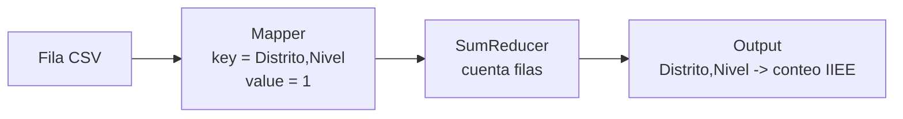

### Consulta 5 — Total NroUsuarios por ComiteCompra+Modalidad
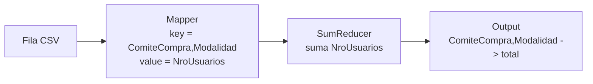

### Consulta 6 — Promedio, mediana y desviación por Departamento
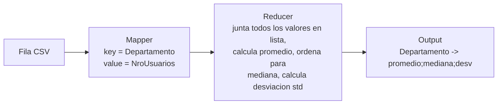

### Consulta 7 — Búsqueda de subtexto "SANTA"
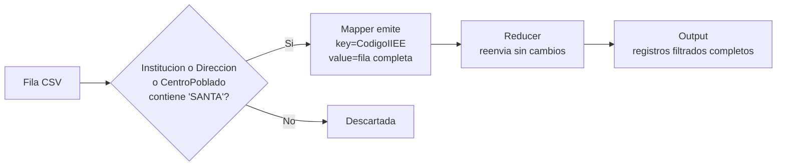

### Consulta 8 — Máximo y mínimo de NroUsuarios por Departamento
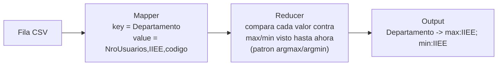

### Consulta 9 — Proporción de NroUsuarios sobre el total del Distrito
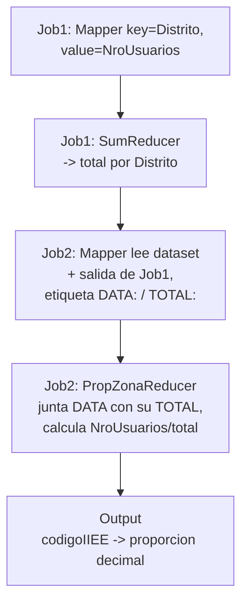

### Consulta 10 — Proporción de NroUsuarios sobre el total de la UnidadTerritorial
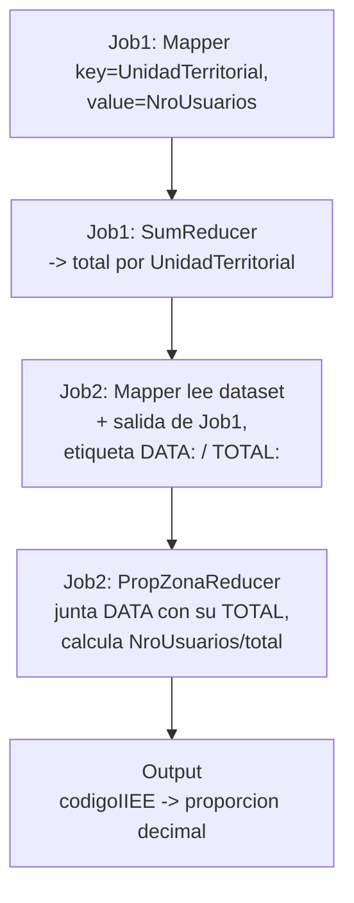

### Consulta 11 — Clasificación de ModalidadAtencion (Regresión Logística)
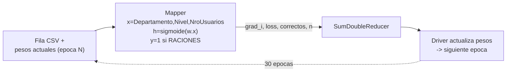

### Consulta 12 — Clasificación de NivelEducativo (Regresión Logística)
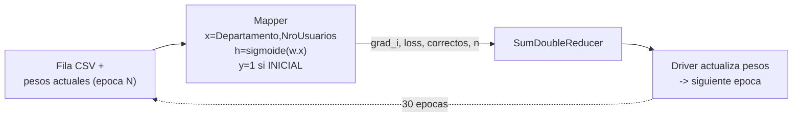

### Consulta 13 — Regresión de NroUsuarios (3 features)
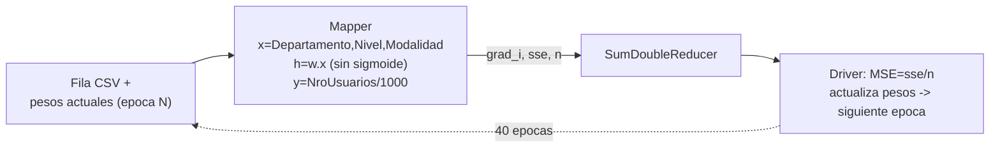

### Consulta 14 — Regresión de NroUsuarios (solo Departamento)
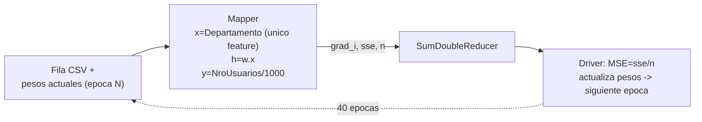

## 6. Mapa general: 7 grupos, 14 consultas

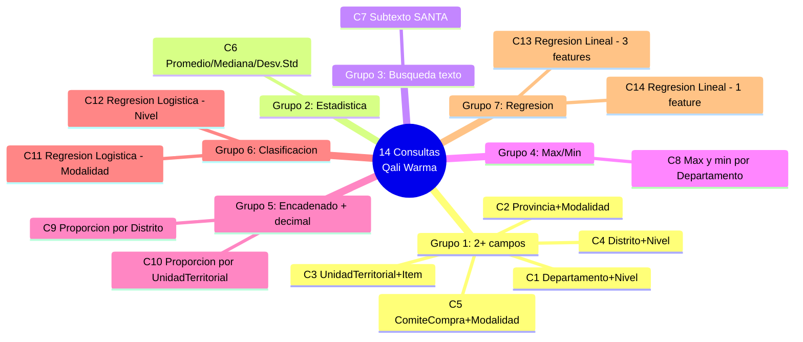
